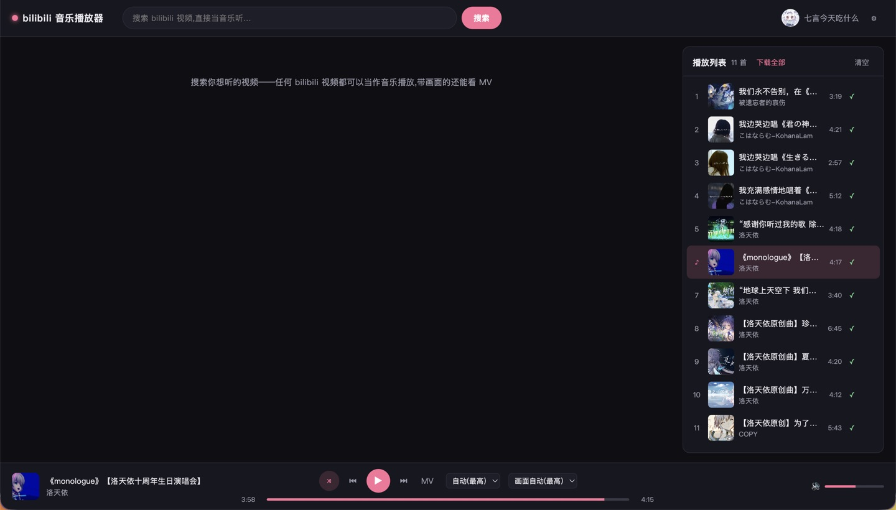
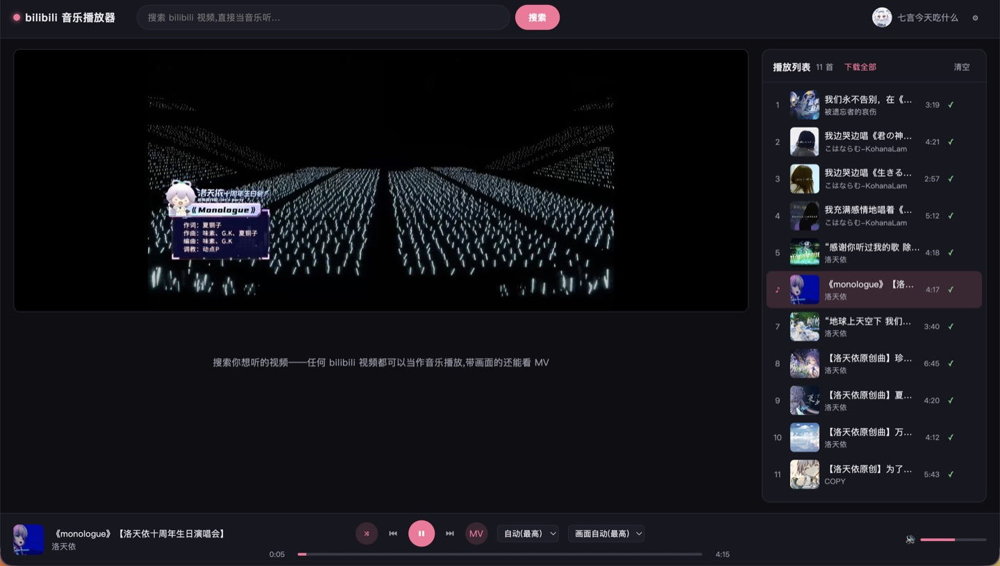

# bilibili-music-player

从 bilibili 获取视频音频的 web 音乐播放器:搜索任何 bilibili 视频,当作音乐播放(带画面的可看 MV),加入播放列表,支持多种播放策略。

## 功能

- **搜索**:全站视频搜索,任何视频都可以听(音频流直出)
- **多音质**:64K / 132K / 192K(登录后可用 Hi-Res / 杜比);视频画质 360P/480P/720P…(登录后更高)
- **MV 模式**:视频条目可切换画面播放(音画同步),音质/画质独立选择
- **播放列表**:持久化到项目目录 `data/playlist.json`,换浏览器不丢
- **本地缓存**(`data/cache/`,音频/视频对称,均为 peer):
  - 每份文件独立保存并带档位标识:`q{音质id}.m4a` + `v{画质id}.mp4`,换档不覆盖
  - **懒下载**:播放过的曲目自动下载(插队优先,音频最高档+视频最高画质);「下载全部」按钮手动批量下载
  - 串行限频下载,任务间/曲目内两个请求之间都有间隔,防触发 bilibili 风控
  - 本地优先播放:音频/视频**独立决策**——各自比较本地最高档与期望档,满足用本地,否则远程(可混合来源)
  - 视频曲目升级旧缓存自动补下画面;远程失败自动回退本地(下架/断网也能听);缓存文件被外部删除自动感知并重下
  - 失败重试 + 播放列表缓存状态图标(✓/↓/◷/!),失败可点击重试
- **播放策略**:
  - 播放模式:顺序播放 / 列表循环 / 单曲循环 / 随机播放
  - 音质切换:保持进度无缝续播,期望音质跨曲目生效
  - CDN 回退:主 CDN 失败自动切换备用节点

## 界面预览

### 主页



### 搜索


### MV 画面



## 架构

```
web/            Vue 3 + Vite 前端(播放器 UI,薄客户端:状态机+渲染)
src/            FastAPI 后端(Spring Boot 式分层)
  ├─ app.py               应用组装:lifespan、中间件、路由注册
  ├─ main.py              入口(uvicorn)
  ├─ routers/             Controller 层(按域:search/track/cache/playlist/settings/auth)
  ├─ services/            Service 层
  │   ├─ search_service.py   全站视频搜索
  │   ├─ parse_service.py    DASH 音视频流解析(限频)
  │   ├─ stream_proxy.py     CDN 流代理(Range 透传、多 CDN 回退)
  │   ├─ download_manager.py 限频下载队列(检查/下载两阶段、点播优先、失败重试)
  │   └─ _utils.py           共享小工具
  ├─ repositories/        Repository 层:cache/playlist/settings/auth 持久化
  ├─ quality.py           Domain 层:档位顺序/标签/期望档选择(唯一事实来源)
  ├─ models.py            Domain 层:数据模型
  └─ config.py            配置(凭证加载、impersonate)
tests/          pytest 冒烟与档位规则测试(uv run pytest tests/)
```

后端依赖上游维护版 [bilibili-api-zoku](https://github.com/bromothymolb/bilibili-api-zoku),通过 GitHub archive tarball 固定 commit 安装(绕开 git 协议,国内网络友好;升级时更新 `pyproject.toml` 中的 commit hash)。

## 开箱即用(Release 包,无需安装 Python)

GitHub Releases 页面提供各平台打包产物(推送 `v*` 标签自动构建):

| 平台 | 产物 |
| --- | --- |
| Windows | `bilibili-music-player-x.y.z-windows.zip` |
| macOS(Apple Silicon / Intel) | `bilibili-music-player-x.y.z-macos-arm64.tar.gz` / `-macos-x86_64.tar.gz` |
| Linux | `bilibili-music-player-x.y.z-linux-x86_64.tar.gz` |

**使用**:下载对应包 → 解压到任意可写目录(桌面/下载等)→ 双击 `bilibili-music-player(.exe)` → 自动打开浏览器。

- 控制台窗口显示运行日志,**关闭窗口即退出服务**;首次打开浏览器需要几秒预热(curl_cffi 伪装指纹 + wbi 签名)
- 歌单/缓存/设置/登录凭证保存在解压目录下的 `data/` 文件夹,整个文件夹拷贝即迁移
- 默认端口 8000,被占用时可用环境变量 `BMP_PORT` 指定其他端口

**手动构建**(需要 uv + Node):

```bash
uv sync
uv run python pyinstaller/build_release.py   # 自动 npm run build + PyInstaller 打包 + 压缩归档
# 产物在 dist_release/ 下
```

## 快速开始

```bash
# 1. 后端(端口 8000)
uv sync
uv run bilibili-music-player

# 2. 前端(端口 5173,dev 模式代理 /api 到后端)
cd web && npm install && npm run dev

# 打开 http://localhost:5173
```

## 登录(可选,获取更高音质)

**推荐:页面内登录**——点右上角「登录」按钮:
- **扫码登录**:bilibili 手机 App 扫码确认(推荐)
- **账号密码**:输入账号密码 + 完成人机验证(极验,SDK 动态加载自官方 CDN);密码仅用于本次请求不保存;触发二次验证(短信等)时请改用扫码
- **手动填写**:从浏览器 Cookie 复制 SESSDATA 等字段(弹窗内有指引)

登录凭证保存在项目目录 `data/auth.json`(已 gitignore),重启后保持;登录后自动解锁 Hi-Res/杜比音质与更高画质。

**备选:`.env` 环境变量**(项目根目录,已 gitignore):

```bash
BILI_SESSDATA=xxxx
BILI_BILI_JCT=xxxx
BILI_BUVID3=xxxx
BILI_BUVID4=xxxx
BILI_DEDEUSERID=xxxx
```

不配置也能正常使用(匿名,音质上限 192K / 画质 480P)。

## 生产模式

```bash
cd web && npm run build     # 产物在 web/dist,后端自动托管
uv run bilibili-music-player
# 直接访问 http://127.0.0.1:8000
```

## 已知限制

- 仅 FLV 流的远古视频不支持播放
- 多 P 视频目前播放 P1,分 P 选择在规划中

## Roadmap

功能优化(2026-08-26 用户提出):

- [x] 搜索 UP 主,进入 UP 主主页查看其全部视频(分页加载,可播放/添加)
- [x] 播放列表内关键词搜索(匹配歌曲名 + UP 主名,过滤保留原始索引)
- [x] 播放列表移除歌曲时同步删除其缓存
- [x] 搜索列表可回退到主页(「← 返回主页」按钮 / 输入框清空 / 品牌 logo 点击)
- [ ] 主页视觉优化(方向未定)
- [ ] 推荐算法(远期大饼)
- [ ] 个人收藏夹支持一键导入收藏夹全部视频
- [ ] 播放列表按账号隔离(依赖远程服务器,远期)

平台/能力扩展:

- [ ] 网易云等更多平台搜索
- [ ] 多 P 视频分 P 选择
- [ ] B 站歌单(AudioList)导入
- [ ] 歌词(弹幕转歌词?)
- [ ] 安卓端(Capacitor / uni-app 打包)
## 免责声明

- 本项目仅供**学习与研究**使用,不用于任何商业用途。
- 所有音视频内容的版权归 bilibili 及各 UP 主所有,请支持正版,尊重创作者。
- 请遵守 bilibili 服务条款及相关法律法规,**请勿**用于批量抓取、二次分发或任何侵犯版权的行为;使用本项目产生的一切后果由使用者自行承担,与开发者无关。
- 请合理设置下载频率,避免对 bilibili 服务器造成负担。

## 致谢

- [bilibili-api-zoku](https://github.com/bromothymolb/bilibili-api-zoku) —— 上游维护版 bilibili API 库,本项目接口层核心依赖
- [Claude Code](https://claude.com/claude-code) 与 [DeepSeek](https://www.deepseek.com/) —— 开发过程中提供 AI 辅助 🥰
